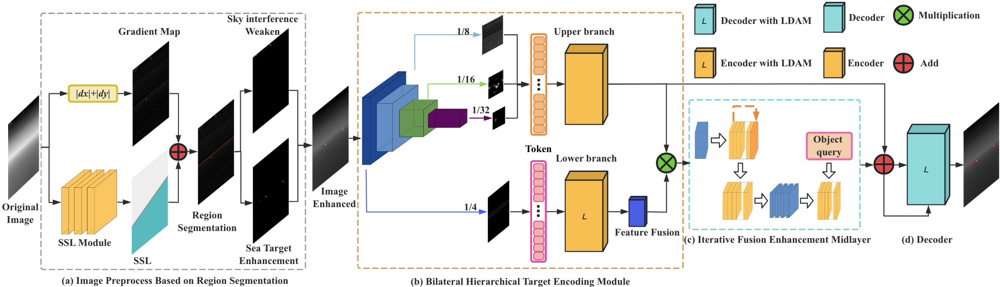

# SIRFM

## Introduction

SIRFM is a sea-sky region segmentation guided IR small targets enhancement and detection Fusion Model that takes SSL as the lead to achieve pixel-level sea and sky region segmentation and thus realize targeted IR small target enhancement and detection.
This open-source code is used to test and verify our paper, or for future comparison.



## License

This project is released under the [Apache 2.0 license](./LICENSE).

## Dataset

The labeled MAR-DCT dataset is already in SIRFM/SIRFM/MAR-DCT. You can generate it by yourself using  
```bash
SIRFM/MAR-DCT-Enhanced-generate/ImgEnhance/main.py
```
( Need to download the trained SSLDetection model [here](https://drive.google.com/file/d/10jKEb8eP5HbcRa8Q35LIO3TIwYor6N8O/view?usp=sharing) for the MAR-DCT dataset first).

We also provide the original MAR-DCT dataset without enhancement, refer to 
```bash
SIRFM/MAR-DCT-Enhanced-generate/MAR-DCT-Original
```

### Requirements

* Linux, CUDA>=9.2, GCC>=5.4
  
* Python>=3.7

    We recommend you to use Anaconda to create a conda environment:
    ```bash
    conda create -n projectName python=3.7 pip
    ```
    Then, activate the environment:
    ```bash
    conda activate projectName
    ```
  
* PyTorch>=1.5.1, torchvision>=0.6.1 (following instructions [here](https://pytorch.org/))

    For example, if your CUDA version is 9.2, you could install pytorch and torchvision as following:
    ```bash
    conda install pytorch=1.5.1 torchvision=0.6.1 cudatoolkit=9.2 -c pytorch
    ```
  
* Other requirements
    ```bash
    pip install -r requirements.txt
    ```

### Compiling CUDA operators
```bash
cd ./models/ops
sh ./make.sh
# unit test (should see all checking is True)
python test.py
```

## Usage

### Dataset preparation

About the dataset's structure please refer to [COCO 2017 dataset](https://cocodataset.org/) and organize them as follows:
```
    data/
        ├── train/
        ├── val/
        └── annotations/
        	├── train.json
        	└── val.json
```
### Steps Before Training

Download SSLDetection model [here](https://drive.google.com/file/d/10jKEb8eP5HbcRa8Q35LIO3TIwYor6N8O/view?usp=sharing) to 
```bash
MAR-DCT-Enhanced-generate/ImgEnhance/experiments/SSLDetection/models
```
Using 
```bash
SIRFM/MAR-DCT-Enhanced-generate/main.py
```
to generate the enhanced images. (The enhanced images of the MAR-DCT dataset are already in SIRFM.)

### Training

SIRFM/SIRFM/train.py

### Test

Download the trained model [here](https://drive.google.com/file/d/1XA-mUlGziADWLzUMgELxeVQUaChzEQSz/view?usp=sharing) to SIRFM/experiments and ten run eval.py.
